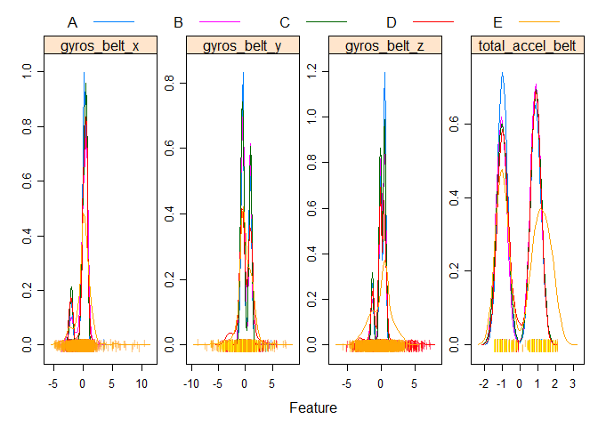
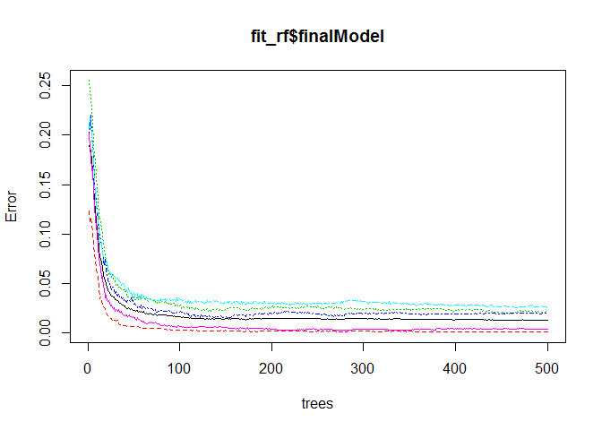
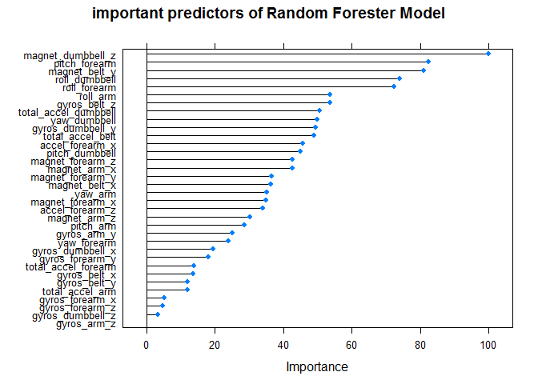
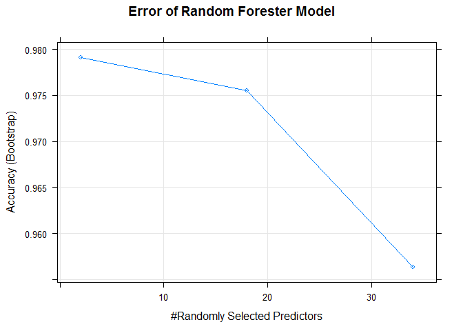

# Classify Excise Manner
yjtsaie  


### Study Goal
  is to predict/classify the manner in which the 6 participants did the exercise by using data from accelerometers on the belt, forearm, arm, and dumbell. 

Data
The training data for this project are available here:
https://d396qusza40orc.cloudfront.net/predmachlearn/pml-training.csv
The test data are available here:
https://d396qusza40orc.cloudfront.net/predmachlearn/pml-testing.csv

#### The classification processes with the given sampling data
##### 1. Split data into ttraining and test set as 60% vs. 40%
##### 2. Build prediction function by 
    A. remove vaiables which do not provide information for model: booking information, very high NA ratio variable, near zero variaance, high correlated variable (>75%)
    B.transform by "center and scale" for not to impact the modeling results
######   The final data set inlcudes 34 predictors (and one dependent variable) reducing from original 160 predictors.  Number of data samples in training set is 11776 and testing set is 7846.

                     sample training testing final training  
                    ------ -------- ------- --------------  
      sample number  19622    11776    7846          11776
      predictors      160      160     160             35  

##### 3 Model select
    With final 31 predictors, 7 models (rpart, linear Dscriminant Analysis, naive Bayes, SVM, random forester, gbm bagging, ) were tried to obtain the best fit model with testing data set. The randome forest came out as best accuarte model.  The combined model for the models having accuarcy >90% was also studied, but its result is not as good as random forester model.  The accuacy data are
    
                rpart_acc   lda_acc   nb_acc   svm_acc    rf_acc   gbm_acc   bag_acc 
                ---------  ---------  -------  --------  --------  --------  --------
       Accuracy 0.4969411  0.5850115  0.714 0.9130767 0.9847056 0.9121846 0.9573031


Confusion Matrix and Statistics

       Prediction    A    B    C    D    E
                A 2223   18    2    0    0  
                B    6 1488   20    0    0  
                C    0   11 1340   37    1  
                D    2    0    6 1248   14  
                E    1    1    0    1 1427  

  Overall Statistics
                                          
               Accuracy : 0.9847          
                 95% CI : (0.9817, 0.9873)
    No Information Rate : 0.2845          
    P-Value [Acc > NIR] : < 2.2e-16       
                                          
                  Kappa : 0.9807          
   Mcnemar's Test P-Value : NA              

   Statistics by Class:

                           Class: A Class: B Class: C Class: D Class: E  
      Sensitivity            0.9960   0.9802   0.9795   0.9705   0.9896 
      Specificity            0.9964   0.9959   0.9924   0.9966   0.9995 
      Pos Pred Value         0.9911   0.9828   0.9647   0.9827   0.9979  
      Neg Pred Value         0.9984   0.9953   0.9957   0.9942   0.9977 
      Prevalence             0.2845   0.1935   0.1744   0.1639   0.1838  
      Detection Rate         0.2833   0.1897   0.1708   0.1591   0.1819 
      Detection Prevalence   0.2859   0.1930   0.1770   0.1619   0.1823 
      Balanced Accuracy      0.9962   0.9881   0.9860   0.9835   0.9946

##### 4. Tuning the model and prediction:  using Caret Train function only mtry parameter is available in caret for tuning. The default control setting was used in this study.
    A. default controlcontrol <- trainControl(method="repeatedcv", number=10, repeats=3)
    B. the rf model was applied to predict/classy the final 20 test samples in quiz and it is 100% accuarate. Prediction results are:
    predict(fit_rf,pml_testing6)  
    B A B A A E D B A A B C B A E E A B B B


# Codes

```r
library(caret)
download.file(url='https://d396qusza40orc.cloudfront.net/predmachlearn/pml-training.csv',
              destfile='pml-training.csv', method='auto')
download.file(url='https://d396qusza40orc.cloudfront.net/predmachlearn/pml-testing.csv',
              destfile='pml-testing.csv', method='auto')
pml_training<-read.csv("~/R/excise/pml-training.csv")
pml_testing<-read.csv("~/R/excise/pml-testing.csv")
#summary(pml_training)
set.seed(321)
indtrain<-createDataPartition(y=pml_training$classe,p=0.6,list=F)
training<-pml_training[indtrain,]
testing<-pml_training[-indtrain,]
nzv<-nearZeroVar(training)
training1<-training[,-nzv]
testing1<-testing[,-nzv]
##drop all na columns
flag1 <-colSums(is.na(training1))== 0
training2<-training1[,flag1]
testing2<-testing1[,flag1] 
## unlated name and data collecting time, book keeping information
training3<-training2[,-c(1:7)] 
training4<-training3[,-52]  #last variable: Classe
#remove highly correlated variables
descrCor <-  cor(training4)
highlyCorDescr <- findCorrelation(descrCor, cutoff = .75)
training5<-training4[,-highlyCorDescr]
training5<-cbind(training5[,],'classe'=training3[,52])
preProcValues <- preProcess(training5, method = c("center", "scale"))
training6 <- predict(preProcValues, training5)
testing3<-testing2[,-c(1:7)] ## name and time
testing5<-testing3[,-highlyCorDescr]
testing6<- predict(preProcValues, testing5)
pml_testing1<-pml_testing[,-nzv]
pml_testing2<-pml_testing1[,flag1]
pml_testing3<-pml_testing2[,-c(1:7)] ## name and time
pml_testing5<-pml_testing3[,-highlyCorDescr]
pml_testing6<- predict(preProcValues, pml_testing5)
## trainsformation: density data for first 4 predictors
## transparentTheme(trans = .9)
featurePlot(x = training6[, 1:4],
            y = training6$classe,
                  plot = "density",
                  scales = list(x = list(relation="free"),
                                y = list(relation="free")),
                  adjust = 1.5,
                  pch = "|",
                  layout = c(4,1),
                  auto.key = list(columns = 5))
```



```r
rm(pml_training,training,training1,training2,training3,training4,training5)
rm(testing,testing1,testing2,testing3,testing5)
rm(pml_testing,pml_testing1,pml_testing2,pml_testing3,pml_testing5)
```

## model selection
1. try all models; not linear model for classification
lm (not uitable), tree;Esemble model: boosting / bagging / random forest
2. compare accuacy

```r
library(forecast)
```

```
## Loading required package: zoo
```

```
## 
## Attaching package: 'zoo'
```

```
## The following objects are masked from 'package:base':
## 
##     as.Date, as.Date.numeric
```

```
## Loading required package: timeDate
```

```
## This is forecast 7.1
```

```r
library(gbm)
```

```
## Loading required package: survival
```

```
## Loading required package: lattice
```

```
## Loading required package: splines
```

```
## Loading required package: parallel
```

```
## Loaded gbm 2.1.1
```

```r
library(rpart)
library(dplyr)
```

```
## 
## Attaching package: 'dplyr'
```

```
## The following objects are masked from 'package:stats':
## 
##     filter, lag
```

```
## The following objects are masked from 'package:base':
## 
##     intersect, setdiff, setequal, union
```

```r
library(party)
```

```
## Loading required package: grid
```

```
## Loading required package: mvtnorm
```

```
## Loading required package: modeltools
```

```
## Loading required package: stats4
```

```
## Loading required package: strucchange
```

```
## Loading required package: sandwich
```

```r
library(ipred)
library(randomForest)
```

```
## randomForest 4.6-12
```

```
## Type rfNews() to see new features/changes/bug fixes.
```

```
## 
## Attaching package: 'randomForest'
```

```
## The following object is masked from 'package:dplyr':
## 
##     combine
```

```r
library(MASS)
```

```
## 
## Attaching package: 'MASS'
```

```
## The following object is masked from 'package:dplyr':
## 
##     select
```

```r
library(klaR)
library(e1071)
```

```
## 
## Attaching package: 'e1071'
```

```
## The following objects are masked from 'package:timeDate':
## 
##     kurtosis, skewness
```

```r
library(AppliedPredictiveModeling)
```

```r
set.seed(123)
fit_rpart<-train(classe ~., method='rpart', data=training6)
rpart_VarImp <- varImp(fit_rpart)
pred_rpart<-predict(fit_rpart, testing6)
rpart_acc<-confusionMatrix(pred_rpart, testing6$classe)$overall[1]

fit_lda<-train(classe~., method='lda',data=training6)
pred_lda<-predict(fit_lda, testing6)
lda_acc<-confusionMatrix(pred_lda, testing6$classe)$overall[1]

fit_nb<-train(classe~.,method='nb',data=training6)
pred_nb<-predict(fit_nb, testing6)
nb_acc<-confusionMatrix(pred_nb, testing6$classe)$overall[1]

fit_svm<-train(classe ~., method="svmRadial",data=training6)
pred_svm<-predict(fit_svm, testing6)
svm_acc<-confusionMatrix(pred_svm, testing6$classe)$overall[1]
```

```r
set.seed(123)
fit_rf<-train(classe ~., method='rf', data=training6)
rf_VarImp <- varImp(fit_rf)
pred_rf<-predict(fit_rf, testing6)
rf_acc<-confusionMatrix(pred_rf, testing6$classe)$overall[1]
```

```r
set.seed(123)
fit_gbm<-train(classe ~., method='gbm', data=training6,verbose=F)
gbm_VarImp <- varImp(fit_gbm)
pred_gbm<-predict(fit_gbm, testing6)
gbm_acc<-confusionMatrix(pred_gbm, testing6$classe)$overall[1]
```

```r
set.seed(123)
fit_bag<-train(classe~., method='treebag', data=training6)
bag_VarImp <- varImp(fit_bag)
pred_bag<-predict(fit_bag, testing6)
bag_acc<-confusionMatrix(pred_bag, testing6$classe)$overall[1]
as.data.frame(cbind(rpart_acc,lda_acc,nb_acc,svm_acc,rf_acc,gbm_acc,bag_acc))
# rpart_acc   lda_acc   nb_acc   svm_acc    rf_acc   gbm_acc   bag_acc 
#                ---------  ---------  -------  --------  --------  --------  --------
       Accuracy 0.4969411  0.5850115  0.714 0.9130767 0.9847056 0.9121846 0.9573031
```

```r
print(fit_rf$finalModel)
```

```
## 
## Call:
##  randomForest(x = x, y = y, mtry = param$mtry) 
##                Type of random forest: classification
##                      Number of trees: 500
## No. of variables tried at each split: 2
## 
##         OOB estimate of  error rate: 1.3%
## Confusion matrix:
##      A    B    C    D    E  class.error
## A 3345    2    0    1    0 0.0008960573
## B   40 2229   10    0    0 0.0219394471
## C    0   29 2014   11    0 0.0194741967
## D    1    1   48 1878    2 0.0269430052
## E    0    1    1    6 2157 0.0036951501
```

```r
plot(fit_rf$finalModel)
```



```r
rf_VarImp
```

```
## rf variable importance
## 
##   only 20 most important variables shown (out of 34)
## 
##                      Overall
## magnet_dumbbell_z     100.00
## pitch_forearm          82.26
## magnet_belt_y          81.00
## roll_dumbbell          73.96
## roll_forearm           72.30
## roll_arm               53.73
## gyros_belt_z           53.71
## total_accel_dumbbell   50.61
## yaw_dumbbell           49.87
## gyros_dumbbell_y       49.34
## total_accel_belt       48.84
## accel_forearm_x        45.75
## pitch_dumbbell         44.87
## magnet_forearm_z       42.65
## magnet_arm_x           42.64
## magnet_forearm_y       36.46
## magnet_belt_x          36.32
## yaw_arm                35.21
## magnet_forearm_x       34.87
## accel_forearm_z        33.96
```

```r
plot(rf_VarImp,main='important predictors of Random Forester Model')
```



```r
fit_rf
```

```
## Random Forest 
## 
## 11776 samples
##    34 predictor
##     5 classes: 'A', 'B', 'C', 'D', 'E' 
## 
## No pre-processing
## Resampling: Bootstrapped (25 reps) 
## Summary of sample sizes: 11776, 11776, 11776, 11776, 11776, 11776, ... 
## Resampling results across tuning parameters:
## 
##   mtry  Accuracy   Kappa    
##    2    0.9791487  0.9736096
##   18    0.9754850  0.9689727
##   34    0.9563163  0.9447111
## 
## Accuracy was used to select the optimal model using  the largest value.
## The final value used for the model was mtry = 2.
```

```r
confusionMatrix(pred_rf, testing6$classe)
```

```
## Confusion Matrix and Statistics
## 
##           Reference
## Prediction    A    B    C    D    E
##          A 2223   18    2    0    0
##          B    6 1488   20    0    0
##          C    0   11 1340   37    1
##          D    2    0    6 1248   14
##          E    1    1    0    1 1427
## 
## Overall Statistics
##                                           
##                Accuracy : 0.9847          
##                  95% CI : (0.9817, 0.9873)
##     No Information Rate : 0.2845          
##     P-Value [Acc > NIR] : < 2.2e-16       
##                                           
##                   Kappa : 0.9807          
##  Mcnemar's Test P-Value : NA              
## 
## Statistics by Class:
## 
##                      Class: A Class: B Class: C Class: D Class: E
## Sensitivity            0.9960   0.9802   0.9795   0.9705   0.9896
## Specificity            0.9964   0.9959   0.9924   0.9966   0.9995
## Pos Pred Value         0.9911   0.9828   0.9647   0.9827   0.9979
## Neg Pred Value         0.9984   0.9953   0.9957   0.9942   0.9977
## Prevalence             0.2845   0.1935   0.1744   0.1639   0.1838
## Detection Rate         0.2833   0.1897   0.1708   0.1591   0.1819
## Detection Prevalence   0.2859   0.1930   0.1770   0.1619   0.1823
## Balanced Accuracy      0.9962   0.9881   0.9860   0.9835   0.9946
```

```r
plot(fit_rf, main='Error of Random Forester Model')
```



```r
predict(fit_rf,pml_testing6)
```

```
##  [1] B A B A A E D B A A B C B A E E A B B B
## Levels: A B C D E
```

```r
set.seed(123)
comb_test<-data.frame(bag_pred=pred_bag,gbm_pred=pred_gbm,rf_pred=pred_rf,svm_pred=pred_svm,'classe'=testing5$classe)
fit_comb<-train(classe~., method='gam',data=comb_test)
pred_comb<-predict(fit_comb,comb_test)
confusionMatrix(pred_comb,testing6$classe)$overall[1] 
# Accuracy 0.4747642 
```
